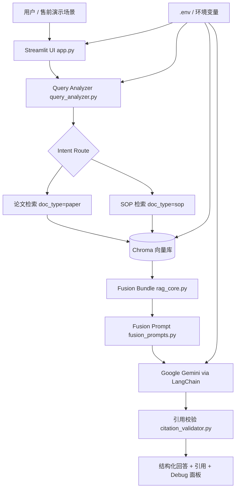

# RMN Agent

## 1. Project Overview

RMN Agent 是一个面向实验室知识工作的 AI Agent 解决方案 Demo，适合作为售前实习、AI Solution Intern 或技术型作品集项目展示。当前实现包含 Streamlit 聊天界面、双路 RAG 检索流程，以及基于证据引用的回答生成能力，主要处理两类知识源：科研论文与实验室手册 / SOP 文档。

这个项目模拟的业务问题很典型：技术团队需要快速从分散的论文、说明书和 SOP 中获得答案，但涉及实验步骤、安全要求或可执行操作时，回答必须可追溯，并且不能把论文中的探索性参数直接当作本地批准的操作规范。RMN Agent 通过知识源分流、意图识别、双路检索、融合生成和引用校验来展示一个更可信的 AI 文档问答方案。

因此，本仓库不只是一个脚本集合，而是一个可以讲清楚业务痛点、方案设计、技术实现和演示价值的 AI Agent Demo。它适合用于面试、作品集、课程项目或售前岗位场景中，展示从需求理解到可运行原型的完整思路。

## 2. Business Scenario

本项目模拟的目标客户是科研实验室、R&D 团队、技术支持团队或设备 / 试剂相关的应用科学团队。典型用户包括研究人员、实验室管理员、应用工程师、技术支持人员，以及需要快速理解复杂技术文档的业务或售前角色。

他们的痛点包括：

- 论文、补充材料、设备说明书和 SOP 分散存放，人工检索效率低。
- 论文中的实验参数有参考价值，但不能直接替代本地批准的 SOP。
- 技术文档问答如果没有引用来源，很难在客户演示或内部评审中建立信任。
- 涉及数字、参数、实验步骤或安全要求时，AI 回答必须尽量可解释、可复查。

RMN Agent 作为 Demo 方案回应这些痛点：入库阶段区分 `paper` 与 `sop`，提问阶段通过 query analyzer 判断用户意图，再从对应知识路径中检索证据，最后生成带引用提示与校验结果的回答。

在面试或售前演示中，这个项目可以被定位为一个“小而完整”的 AI 解决方案原型：它体现了业务场景理解、RAG 架构设计、Agent 流程编排、客户价值表达，以及对 AI 风险和边界的认识。

## 3. Key Features

- **论文 / SOP 双路检索**：论文和手册在入库时使用不同的 `doc_type` 元数据，并在检索时分路处理。业务价值：可以向面试官或客户解释为什么研究证据和操作规范不能混在一起。
- **意图感知的 Query Routing**：`query_analyzer.py` 将问题分类为 `SOP_ONLY`、`PAPER_ONLY` 或 `HYBRID`，同时区分 `SCHOLARLY`、`OPERATIONAL`、`HYBRID` 等回答模式。业务价值：Agent 会根据用户问题调整行为，而不是套用固定问答模板。
- **Streamlit 演示界面**：`app.py` 提供聊天入口、知识库文件列表、入库按钮、单篇论文锁定、流式回答、引用展示和 debug 面板。业务价值：项目具备可直接演示的前端界面，适合面试和作品集展示。
- **基于证据的回答生成**：`fusion_prompts.py` 要求模型只基于检索片段回答，并保留 `citation_hint`。业务价值：展示如何减少无依据回答，提高技术文档问答的可信度。
- **引用校验层**：`citation_validator.py` 检查回答中的引用是否来自当前检索结果，并标记缺少引用的数字型声明。业务价值：Demo 不只停留在“能生成答案”，还加入了轻量级质量控制。
- **文档入库流水线**：`ingest.py` 支持 `data/papers/` 与 `data/manuals/` 下的 PDF 和 `.docx` 文件，完成解析、切分、嵌入、Chroma 入库和处理记录维护。业务价值：体现知识库可更新、可维护的交付思路。
- **论文范围控制与重排**：UI 支持锁定单篇论文，`fusion_scope.py` 支持 metadata filter 与标题软匹配重排。业务价值：可展示如何降低跨文档混淆和错误引用风险。
- **测试与烟测评估**：`tests/` 和 `eval/rag_eval.py` 覆盖 query fallback、scope 过滤、引用校验、入库前缀和检索 smoke cases。业务价值：说明项目具备基本验证意识，而不是一次性 Demo。

## 4. Solution Architecture

当前实现架构如下：



架构层说明：

- **用户输入层**：`app.py` 中的 Streamlit chat input 接收用户问题，侧边栏可选择是否锁定某一篇论文。
- **Agent 编排层**：`query_analyzer.py` 和 `rag_core.py` 负责意图分析、检索参数准备、上下文拼装和每轮 prompt 组装。
- **工具 / 能力层**：包括文档入库、Chroma 检索、向量 + 词法混合召回、论文范围过滤、补充材料增强、引用格式化和引用校验。
- **模型调用层**：通过 LangChain 调用 Google Generative AI 进行 query analysis 和回答生成；嵌入模型可通过 `EMBEDDING_PROVIDER` 选择 Google/Gemini、OpenAI、智谱或 HuggingFace。
- **输出层**：Streamlit UI 流式展示回答，并显示论文引用、手册引用、query analysis 和 citation validation 结果。
- **配置层**：`.env.example` 说明模型密钥、Chroma 设置、解析选项、检索调参和入库调参；运行时通过 `python-dotenv` 读取。

需要注意：当前仓库没有生产级 API Server、用户认证、CRM 集成、监控面板或 Docker 部署。这些内容已在后续优化中列为规划方向，而不是已完成功能。

## 5. Tech Stack

- **Python 3.10+**：项目主要开发语言，用于 Agent、入库、评估和测试。
- **Streamlit**：提供本地聊天式 Demo UI，对应 `app.py`。
- **LangChain / LangChain Core**：用于 prompt chain、Document 抽象、输出解析和模型集成。
- **LangChain Google GenAI**：连接 Google Gemini，用于 query analysis 和回答生成。
- **Chroma / LangChain Chroma**：本地持久化向量库，用于存储和检索文档 chunk。
- **Pydantic**：定义结构化 query analysis 输出模型。
- **python-dotenv**：从 `.env` 加载本地运行配置。
- **LlamaParse**：可选文档解析能力，在配置 `LLAMA_CLOUD_API_KEY` 后使用。
- **pdfplumber**：可选 PDF fallback 解析能力。
- **python-docx**：支持本地 `.docx` 文档解析。
- **sentence-transformers**：在选择 HuggingFace embedding provider 时使用。
- **pytest / unittest**：用于本地测试和基础验证。

## 6. Repository Structure

```text
RMN_Agent/
├── app.py
├── ingest.py
├── rag_core.py
├── query_analyzer.py
├── fusion_prompts.py
├── fusion_scope.py
├── citation_validator.py
├── list_chroma_catalog.py
├── sample_chroma_snippets.py
├── data/
│   ├── papers/
│   └── manuals/
├── eval/
│   ├── golden_questions.jsonl
│   └── rag_eval.py
├── tests/
│   ├── test_citation_validator.py
│   ├── test_fusion_scope.py
│   ├── test_ingest_prefix.py
│   └── test_query_analyzer_fallback.py
├── docs/
│   ├── architecture.md
│   ├── demo_script.md
│   └── presales_positioning.md
├── .env.example
├── Makefile
├── pyproject.toml
├── requirements.txt
└── README.md
```

主要目录和文件职责：

- `app.py`：Streamlit 交互入口和 Demo UI。
- `ingest.py`：文档解析、元数据抽取、切分、embedding、Chroma 入库、处理记录和 corpus manifest。
- `rag_core.py`：向量库加载、双路检索、混合召回、SI 增强、上下文格式化和 LLM chain 构建。
- `query_analyzer.py`：结构化 query 分析，包含 LLM 路径和保守的 heuristic fallback。
- `fusion_prompts.py`：scholarly、operational、hybrid 回答模式的 prompt 片段。
- `fusion_scope.py`：论文 source 过滤、标题软匹配和检索 `k` 调整。
- `citation_validator.py`：生成后引用校验。
- `eval/`：golden questions 与检索 smoke evaluation。
- `tests/`：不依赖外部 API 的单元测试。
- `data/papers/` 与 `data/manuals/`：本地文档投放目录；当前仓库只包含占位文件，不包含真实客户数据。

## 7. Getting Started

克隆仓库并进入项目目录：

```bash
git clone <your-repo-url>
cd RMN_Agent
```

创建并激活虚拟环境：

```bash
python -m venv .venv
source .venv/bin/activate
```

安装依赖：

```bash
pip install -r requirements.txt
```

创建本地配置文件：

```bash
cp .env.example .env
```

根据本地情况填写密钥。默认 Google 路径至少需要 `GOOGLE_API_KEY` 或 `GEMINI_API_KEY`。如果没有 LlamaParse key，但希望使用 PDF fallback，可按需设置 `INGEST_PDFPLUMBER_FALLBACK=true`。

添加文档：

```text
data/papers/   # 论文、正文、补充材料
data/manuals/  # SOP、设备手册、操作说明
```

执行入库：

```bash
make ingest
```

如果语料目录为空，入库脚本会因为没有可索引文件而非零退出。完整 Demo 前请至少放入一个支持的 `.pdf` 或 `.docx` 文件。

全量重建向量库：

```bash
make rebuild
```

启动 Streamlit UI：

```bash
make app
```

运行测试和烟测：

```bash
make test
make smoke
make eval
```

推荐 Demo 问题：

- `这篇论文里的 microgel 制备步骤和关键参数是什么？`
- `如果我要参考论文复现实验，哪些步骤需要同时核对本实验室 SOP？`
- `对比两篇 3D microgel mechanical stimulation 论文，刺激方式、时间和细胞响应有什么差异？`
- `Leica DMi8 手册中有哪些基础操作或安全注意事项？`
- `当前检索上下文里缺少哪些 protocol 细节？`

## 8. Demo Flow

1. 介绍业务背景：实验室或 R&D 团队有大量论文和 SOP，但用户需要更快、更可追溯地获取答案。
2. 展示仓库结构：说明 `data/papers/` 与 `data/manuals/` 在入库前就被区分。
3. 放入示例 `.pdf` 或 `.docx` 文件，运行 `make ingest` 建立本地 Chroma 知识库。
4. 打开 Streamlit App，先提一个论文型问题，展示 paper path 检索和引用结果。
5. 再提一个操作型或复现实验问题，展示 Agent 如何同时考虑论文参数和 SOP 约束。
6. 打开 debug 面板，讲解 query routing、retrieved references 和 citation validation。
7. 总结客户价值：提升技术文档检索效率、增强回答可追溯性，并避免把论文内容误当作批准流程。

## 9. Presales Value

RMN Agent 可以体现以下售前实习 / AI Solution Intern 能力：

- **业务需求理解**：项目从真实知识工作痛点出发，而不是泛泛做一个聊天机器人。
- **技术方案表达**：能把业务问题映射到 ingestion、routing、retrieval、generation、validation 的 RAG 架构。
- **AI Agent Demo 搭建**：Streamlit UI 支持短时间内完成可视化演示。
- **客户价值转译**：把技术功能转化为可追溯性、安全边界、演示可用性和运营决策支持。
- **可扩展方案思维**：当前本地原型可以继续扩展到 UI、API、权限、监控和企业系统集成。
- **文档化与交付意识**：README、架构文档、演示脚本、环境变量模板和测试说明共同构成可交付材料。

## 10. Future Improvements

以下内容是后续优化方向，不是当前代码已完成能力：

- **Web UI 优化**：增加更清晰的上传流程、Demo preset、结果导出和用户引导。
- **多轮对话记忆**：显式管理 follow-up question 的上下文和历史状态。
- **CRM / 数据库集成**：将回答、客户场景或实验记录连接到外部系统。
- **权限控制**：按用户、项目或文档类型限制访问范围。
- **日志与监控**：记录检索质量、模型错误、延迟和用户反馈。
- **Docker 部署**：打包 app、Chroma 持久化目录和运行配置，方便演示交付。
- **更完整的测试**：补充 ingest、Chroma retrieval、Streamlit workflow 等集成测试。
- **行业场景模板**：为 biotech、medical devices、chemical R&D、technical support 等场景准备非敏感 Demo 语料。
- **评估 Dashboard**：将现有 JSONL smoke evaluation 升级为更直观的演示准备报告。

## 11. Disclaimer

本项目是学习、作品集和售前 Demo 项目，不包含真实客户数据、生产环境密钥、经过验证的安全流程或生产级访问控制。任何真实实验操作必须以机构批准的 SOP、安全评估和人工监督为准。
