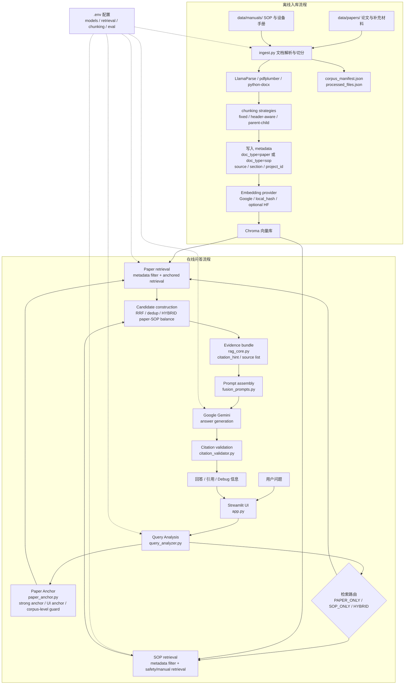
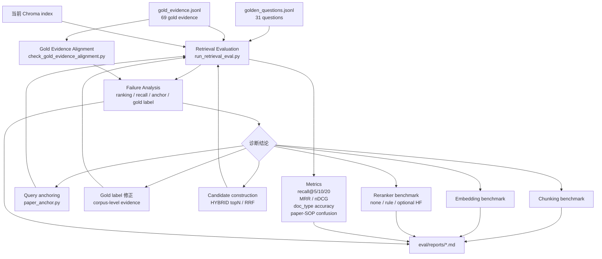

# RMN Agent

一个面向科研文档和实验室 SOP 的双路 RAG 助手，用来区分“论文证据”和“可执行操作规范”。

## 1. 项目概述

RMN Agent 是一个本地运行的实验室知识问答原型。它面向科研论文、补充材料、设备手册和 SOP 文档，提供从文档入库、问题分析、双路检索、基于证据生成回答到引用检查的一套 RAG 流程。

这个项目要解决的问题不是“让模型读更多文档”这么简单。在实验室和 R&D 场景里，论文里的方法和参数往往是研究证据，能帮助理解实验设计、材料选择和观察结果；但 SOP、设备手册和本地规范才更接近可执行流程、安全要求和机构约束。把这些来源直接混在一起检索，可能让回答看起来很完整，却模糊了“学术参考”和“本地批准操作”之间的边界。

RMN Agent 的核心设计是把论文与 SOP / 手册在入库、检索和回答解释上分开处理。系统会先分析用户问题，判断它更偏论文解读、操作规范，还是需要二者结合；随后从 Chroma 向量库中按 `doc_type=paper` 或 `doc_type=sop` 分路召回片段，并在 Prompt 中要求回答基于检索证据、保留引用线索。

当前版本已经实现 Streamlit 聊天式界面、本地文档入库、Chroma 检索、Google Gemini 调用、查询路由、回答引用线索、轻量级 citation validation、单篇论文范围控制、debug 面板以及基础测试和评估脚本。它不是生产系统，也没有权限、审计、监控或企业集成。

作为作品集项目，RMN Agent 适合展示 AI Agent、RAG 系统设计、文档工程、技术风险意识、技术方案表达和演示型原型构建能力。它的价值首先来自一个清楚的技术边界：论文证据可以帮助理解和对比，SOP / 手册才应承担操作约束的角色。

## 2. 核心问题：为什么要区分论文和 SOP？

论文通常包含探索性方法、实验参数、材料配方、观察结果和学术解释。它们适合回答“研究中怎么做”“参数范围是什么”“不同论文结果有什么差异”这类问题，但论文中的实验条件不一定适用于当前实验室，也不一定经过本地安全、设备或流程审批。

SOP、设备手册和实验室规范的角色不同。它们通常包含被批准的操作流程、安全要求、设备限制、维护说明、校准步骤和本地约束。对于实际操作问题，系统不能把论文中的探索性参数直接当成本地流程，更不能在缺少 SOP 证据时假装已经确认。

如果 RAG 系统把两类文档放进同一个检索路径，模型可能会把论文片段里的方法描述和 SOP 片段里的操作要求混在一起回答。对于普通知识问答，这可能只是引用不清；对于实验室、R&D 或技术支持场景，这会影响可追溯性和风险判断。

RMN Agent 因此把来源类型作为系统设计的一部分，而不是后处理标签。入库时写入 `doc_type`，检索时按路径过滤，回答时区分论文证据和 SOP / 手册约束，最后再对回答中的引用线索做轻量检查。

| 文档类型 | 典型内容 | 在 RMN Agent 中的角色 |
|---|---|---|
| 论文 / 补充材料 | 方法、参数、实验设计、结果解释 | 作为研究证据和学术参考 |
| SOP / 手册 | 标准流程、安全要求、设备操作、限制条件 | 作为操作规范和执行约束 |

## 3. 当前功能

### 论文 / SOP 双路检索

- 当前实现：`ingest.py` 扫描 `data/papers/` 和 `data/manuals/`，分别写入 `doc_type=paper` 与 `doc_type=sop`。`rag_core.py` 在检索阶段把 `doc_type` 与可选元数据过滤条件合并，按论文路径、SOP 路径或混合路径召回片段。
- 为什么重要：论文可以作为研究证据，但不应自动变成可执行流程。双路检索让回答能说明“这个结论来自论文”还是“这个约束来自 SOP / 手册”。
- 对应代码位置：`ingest.py`、`rag_core.py`。

### Query Analysis 与问题路由

- 当前实现：`query_analyzer.py` 使用 Pydantic 定义结构化输出，字段包括 `intent`、`answer_mode`、`paper_scope_source`、`paper_scope_project_id`、`paper_scope_paper_title`、`requires_full_protocol` 和双路 `search_queries`。可用时通过 Google Gemini 做结构化分析；不可用时使用规则 fallback。
- 为什么重要：用户问题可能是论文型、操作型或混合型。先分析问题，再决定检索路径，可以减少无差别检索导致的来源混淆。
- 对应代码位置：`query_analyzer.py`、`rag_core.py`。

### Streamlit 聊天式演示界面

- 当前实现：`app.py` 提供本地 Streamlit 聊天界面，侧边栏展示论文与手册目录，支持触发入库、全量重建、选择单篇论文范围、查看最近一次 query analysis。回答区域展示流式生成结果、论文引用、手册引用和 citation validation debug 信息。
- 为什么重要：这个项目可以被现场演示，而不是只停留在命令行脚本。面试或项目展示时，可以直接展示从提问到检索、回答、引用检查的完整路径。
- 对应代码位置：`app.py`。

### 文档入库流水线

- 当前实现：`ingest.py` 支持 `.pdf` 和 `.docx` 文件。PDF 可通过 LlamaParse 解析，也可在配置允许时用 pdfplumber 兜底；Word 文档通过 python-docx 解析。入库流程包括目录扫描、论文与手册分类、论文正文与补充材料的文件名规则配对、文本切分、embedding、写入 Chroma、维护 `processed_files.json` 和 `corpus_manifest.json`。
- 为什么重要：RAG 的质量高度依赖入库质量。把论文和手册在入库阶段就分开，可以让后续检索、引用和 debug 都有明确的元数据基础。
- 对应代码位置：`ingest.py`。

### Chroma 向量库检索

- 当前实现：`rag_core.py` 通过 `langchain_chroma.Chroma` 读取本地持久化 collection。检索时使用 `doc_type` 过滤，并支持可配置的向量检索或向量 + 词法混合召回。检索参数通过 `.env` 中的 `RAG_RETRIEVAL_MODE`、`HYBRID_LEXICAL_WEIGHT`、`HYBRID_LEXICAL_POOL_LIMIT` 等变量控制。
- 为什么重要：Chroma 提供本地可复现的向量检索能力，适合 Demo 和作品集场景；元数据过滤让系统能按来源类型控制召回范围。
- 对应代码位置：`rag_core.py`、`ingest.py`、`.env.example`。

### 基于证据的回答生成

- 当前实现：`rag_core.py` 将检索到的论文片段和 SOP 片段格式化为上下文块，再由 `fusion_prompts.py` 组装系统 Prompt。Prompt 要求模型只基于参考块回答，遇到缺失证据时明确说明，不虚构参数、统计值或操作步骤。
- 为什么重要：RAG 系统的可信度不只取决于“能否回答”，还取决于回答是否能回到检索证据。这个设计让模型输出更容易被复查。
- 对应代码位置：`rag_core.py`、`fusion_prompts.py`。

### 引用线索与 citation validation

- 当前实现：`rag_core.py` 在上下文块中生成 `citation_hint`，回答 Prompt 要求模型逐字保留引用线索。`citation_validator.py` 会检查回答中出现的 `[Source: ...]` 是否来自本轮检索结果，并标记缺少引用的数字型声明。当前为轻量级实现，不做完整语义事实验证。
- 为什么重要：引用线索能帮助用户追溯来源；轻量校验可以发现一些常见问题，例如模型引用了本轮没有检索到的来源，或给出带单位的参数却没有引用。
- 对应代码位置：`rag_core.py`、`fusion_prompts.py`、`citation_validator.py`。

### 单篇论文锁定或范围控制

- 当前实现：`app.py` 侧边栏允许选择某一篇 `data/papers/` 下的论文作为 `source` 范围。`query_analyzer.py` 也可以从问题中提取文件名、项目或标题范围。`fusion_scope.py` 负责构造 Chroma 元数据过滤条件，并对标题提示做软重排。
- 为什么重要：当知识库中有多篇相近论文时，单篇锁定可以降低跨文档混淆和错误引用风险。标题软重排则避免过度依赖易碎的精确标题匹配。
- 对应代码位置：`app.py`、`query_analyzer.py`、`fusion_scope.py`、`rag_core.py`。

### Debug 面板

- 当前实现：Streamlit 界面显示本轮 `intent`、`answer_mode`、`requires_full_protocol`、实体、检索说明、论文 / SOP chunk 数量和 citation validation 结果。侧边栏也保留最近一次 query analysis。
- 为什么重要：debug 面板让检索路径、意图判断和引用校验更透明，适合技术面试、方案讲解和问题排查。
- 对应代码位置：`app.py`。

### 基础测试与评估脚本

- 当前实现：`tests/` 覆盖 query analyzer fallback、fusion scope、paper anchor、gold evidence alignment、citation validator、ingest 前缀等单元测试（`make test`）。评估侧已扩展为**可复现的 RAG evaluation framework**，而不仅是 smoke check：
  - **Retrieval**：`eval/run_retrieval_eval.py`（route、recall@k、MRR、nDCG、paper/SOP 混淆）
  - **Gold evidence 对齐**：`eval/check_gold_evidence_alignment.py`（`make eval-gold-check`）
  - **扩展集汇总**：`eval/run_expanded_eval_summary.py`（分类型指标 + failure analysis，`make eval-expanded`）
  - **Failure analysis**：`eval/run_google_embedding_failure_analysis.py`（top-20 深潜与根因标签）
  - **Generation / RAGAS（可选）**：`eval/run_generation_eval.py`、`eval/run_ragas_eval.py`
  - **Benchmark**：`eval/run_chunking_benchmark.py`、`eval/run_embedding_benchmark.py`、`eval/run_rerank_benchmark.py`
- 辅助工具：`sample_chroma_snippets.py`、`list_chroma_catalog.py` 用于查看本地 Chroma 内容与入库质量。
- 为什么重要：面试演示时可展示「发现问题 → 解释 failure → 修正 gold → 扩展 hard cases」的完整评估闭环，而不只是单次聊天 Demo。
- 对应代码位置：`tests/`、`eval/`、`eval/golden_questions.jsonl`、`eval/gold_evidence.jsonl`、`sample_chroma_snippets.py`、`list_chroma_catalog.py`。

## 4. 系统工作流

用户在 Streamlit 界面输入问题后，`app.py` 会先调用 `query_analyzer.py` 对问题做结构化分析。分析结果会判断问题更适合走 `PAPER_ONLY`、`SOP_ONLY` 还是 `HYBRID` 路径，同时给出回答模式、实体、检索 query 和可选论文范围。

随后 `rag_core.py` 根据分析结果从 Chroma 中召回相关片段。如果问题偏论文，系统主要检索 `doc_type=paper`；如果问题偏手册或 SOP，系统检索 `doc_type=sop`；如果问题需要结合研究证据和操作约束，则两条路径都会执行。论文路径还支持按 `source`、`project_id` 或标题提示进行范围控制。

检索完成后，系统把论文片段和 SOP 片段分别组装成带 `citation_hint` 的上下文块，再由 `fusion_prompts.py` 生成回答 Prompt。Prompt 会根据 `answer_mode` 调整回答形态：论文型问题偏方法、结果和对比；操作型问题强调 SOP 对齐和风险提示；混合型问题允许结合两类证据，但不能把论文参数直接当成本地批准流程。

LLM 返回回答后，`citation_validator.py` 对回答中的引用和数字型声明做轻量检查。最终 Streamlit 界面展示回答、论文引用、手册引用、query analysis、检索结果数量和 citation validation 结果。这个流程的重点是把模型回答背后的检索路径和来源类型显示出来，而不是只给一个最终文本。

## 5. 系统架构

下图 1 为 **在线问答 / RAG 主流程**（生产 Demo 路径）。Chroma 只是向量库；检索、anchor、候选合并与 prompt 编排均在 Python 层完成。**Rule reranker 不是默认主链路**（`RERANKER_PROVIDER=none`），仅作为 benchmark / ablation 可配置项；评估闭环见下文「RAG 实验与评估」图 2。

### 图 1：RMN Agent 在线问答 / RAG 主流程



#### 分层说明

1. **离线入库层**
   - `ingest.py` 扫描 `data/papers/` 与 `data/manuals/`，在入库阶段即写入 `doc_type=paper` 或 `doc_type=sop`。
   - 支持 PDF / docx 解析（LlamaParse、pdfplumber、python-docx），经 chunking 策略切分后生成 embedding 并写入 Chroma。
   - 维护 `corpus_manifest.json` 与 `processed_files.json`，用于可复现入库与 eval 对齐。

2. **交互层**
   - `app.py` 提供 Streamlit UI：提问、论文范围选择、入库按钮、引用展示与 debug 面板。

3. **问题分析与 anchor 层**
   - `query_analyzer.py` 判断 route（`PAPER_ONLY` / `SOP_ONLY` / `HYBRID`）与 `answer_mode`。
   - `paper_anchor.py` 处理强论文信号、UI anchor、corpus-level question guard；**corpus-level 问题不应自动锁定单篇论文**。

4. **检索与候选构建层**
   - `rag_core.py` 按 paper / SOP / HYBRID 分路检索；paper path 支持 **anchored retrieval**。
   - HYBRID 路径分别构建 paper / SOP 候选池（topN ≥ 20），再经 **RRF / dedup / final context selection** 合并为 evidence bundle。
   - `fusion_scope.py` 负责论文范围过滤与标题软重排。**Rule reranker 仅作 ablation / benchmark，默认关闭**（`RERANKER_PROVIDER=none`）。

5. **生成与校验层**
   - `fusion_prompts.py` 按 scholarly / operational / hybrid 组装 prompt。
   - Google Gemini 生成回答；`citation_validator.py` 做轻量引用检查。
   - Streamlit 展示回答、引用线索与 retrieval debug 信息。

## 6. 技术栈

- Python：项目主要开发语言，用于入库、RAG 编排、检索、评估和测试。
- Streamlit：提供本地聊天式演示界面，对应 `app.py`。
- LangChain：用于 Document 抽象、Prompt 编排、输出解析、模型调用和 Chroma 集成。
- Google Gemini / Google Generative AI：用于 query analysis、回答生成和默认 Google embedding 路径，需要配置 API Key。
- Chroma：本地持久化向量库，用于保存论文和 SOP / 手册 chunk，并支持基于元数据的过滤检索。
- Pydantic：定义 query analysis 的结构化输出模型，减少下游字段混乱。
- python-dotenv：从 `.env` 加载本地运行配置。
- LlamaParse：可选 PDF 解析服务，用于尽量保留文档结构；需要 `LLAMA_CLOUD_API_KEY`。
- pdfplumber：PDF fallback 解析工具，在未使用 LlamaParse 或解析失败时可按配置启用。
- python-docx：解析 `.docx` 手册、SOP 或论文文档。
- sentence-transformers：选择 HuggingFace embedding provider 时使用。
- pytest / unittest：项目中 `Makefile` 通过 `unittest` 运行测试，依赖列表包含 pytest，便于后续扩展测试方式。

## 7. 仓库结构

```text
RMN_Agent/
├── app.py
├── ingest.py
├── rag_core.py
├── query_analyzer.py
├── fusion_prompts.py
├── fusion_scope.py
├── citation_validator.py
├── list_chroma_catalog.py
├── sample_chroma_snippets.py
├── data/
│   ├── papers/
│   └── manuals/
├── eval/
│   ├── golden_questions.jsonl
│   ├── gold_evidence.jsonl
│   ├── run_retrieval_eval.py
│   ├── check_gold_evidence_alignment.py
│   └── reports/
├── tests/
│   ├── test_citation_validator.py
│   ├── test_fusion_scope.py
│   ├── test_ingest_prefix.py
│   └── test_query_analyzer_fallback.py
├── docs/
│   ├── architecture.md
│   ├── demo_script.md
│   └── presales_positioning.md
├── .env.example
├── Makefile
├── pyproject.toml
├── requirements.txt
└── README.md
```

- `app.py`：Streamlit 交互入口，负责本地聊天界面和 debug 展示。
- `ingest.py`：文档解析、分类、切分、embedding、Chroma 入库和处理记录维护。
- `rag_core.py`：RAG 主流程，负责检索、上下文组装、Prompt 调用和引用列表格式化。
- `query_analyzer.py`：问题分析与检索路由，包含 LLM 分析和规则 fallback。
- `fusion_prompts.py`：回答生成 Prompt 的规则集合。
- `fusion_scope.py`：论文范围过滤、标题软匹配和检索数量调整。
- `citation_validator.py`：回答生成后的轻量引用检查。
- `list_chroma_catalog.py`：查看 Chroma 中已入库文档目录。
- `sample_chroma_snippets.py`：抽样查看 Chroma chunk，便于检查入库效果。
- `data/papers/`：放置本地论文、正文或补充材料。
- `data/manuals/`：放置本地 SOP、设备手册或操作说明。
- `eval/`：检索烟测问题、gold evidence、评估脚本与 [`eval/reports/`](eval/reports/) 实验报告。
- `tests/`：不依赖真实客户数据的基础单元测试。
- `docs/`：架构说明、演示脚本和作品集定位说明。

## 8. 本地运行

1. 克隆仓库并进入目录：

```bash
git clone <your-repo-url>
cd RMN_Agent
```

2. 创建并激活虚拟环境：

```bash
python -m venv .venv
source .venv/bin/activate
```

3. 安装依赖：

```bash
pip install -r requirements.txt
```

4. 创建本地配置文件：

```bash
cp .env.example .env
```

5. 配置 API Key：

默认配置使用 Google Gemini 路径。至少需要在 `.env` 中填写 `GOOGLE_API_KEY` 或 `GEMINI_API_KEY`。如果使用 LlamaParse 解析 PDF，还需要填写 `LLAMA_CLOUD_API_KEY`；如果没有 LlamaParse key，可以按需设置 `INGEST_PDFPLUMBER_FALLBACK=true` 使用 pdfplumber 兜底。不要提交真实 API Key。

6. 放入论文和 SOP / 手册文件：

```text
data/papers/   # 论文、正文、补充材料
data/manuals/  # SOP、设备手册、操作说明
```

默认文档解析是本地路线：PDF 使用 `pdfplumber`，Word 使用 `python-docx`。不需要 LlamaParse，也不会消耗 LlamaParse credits。

当前仓库只保留目录占位，不包含真实客户数据或示例语料。如果这两个目录没有可索引的 `.pdf` 或 `.docx` 文件，入库和完整问答演示无法正常完成。

7. 执行入库：

```bash
make ingest
```

如需清空本地向量库并重新入库：

```bash
make rebuild
```

8. 启动 Streamlit：

```bash
make app
```

9. 运行测试和基础检查：

```bash
make test
make smoke
make eval-gold-check
make eval-retrieval
make eval-expanded
```

`make smoke` 和 `make eval-*` 会依赖本地 Chroma 内容。若没有先完成入库，相关检查可能无法得到有意义结果。

## 调试与实验比较

本项目建议把每次调参当作一次可复现实验，而不是只看 Streamlit 当前回答。

1. 跑 baseline 并保存完整检索记录：

```bash
.venv/bin/python eval/run_experiment.py \
  --questions eval/golden_questions.jsonl \
  --config eval/configs/baseline.json
```

结果会写入 `eval/runs/<run_id>.jsonl`。每个 case 会记录 config、query analysis、检索到的 paper/SOP chunks、source、latency 和基础 metrics。
这些 JSONL 是本地调试产物，可能包含检索片段和生成答案，默认不提交到 GitHub。

2. 对比两次或多次运行：

```bash
.venv/bin/python eval/compare_runs.py \
  eval/runs/<baseline>.jsonl \
  eval/runs/<candidate>.jsonl \
  --out compare_baseline_candidate.md
```

报告会列出 route accuracy、required source hit、citation ok（若生成答案）、latency、自动 score，以及逐 case 的 improvements/regressions。自动 score 只用于筛选候选，不替代人工审查实验安全类答案。

3. 审计知识库覆盖：

```bash
.venv/bin/python eval/audit_corpus.py --out eval/reports/corpus_audit.json
```

该脚本对齐磁盘文档、`processed_files.json` 和 Chroma `source`，用于发现“磁盘有但未入库”“processed 记录存在但 Chroma 无 chunk”等问题。当前 ingest 会递归扫描 `data/papers/` 与 `data/manuals/`。

4. 审计本地解析质量（不写 Chroma）：

```bash
.venv/bin/python eval/parse_audit.py --parser fallback --limit 5 \
  --out eval/runs/parse_audit_local_sample.jsonl
```

5. 可选：比较 LlamaParse 与本地 fallback（默认不推荐，可能消耗付费 credits）：

```bash
.venv/bin/python eval/parse_audit.py --parser both --limit 5 \
  --out eval/runs/parse_audit_sample.jsonl
```

只有在安装 `llama-parse`、设置 `INGEST_USE_LLAMAPARSE=true` 并配置 `LLAMA_CLOUD_API_KEY` 时，入库才会尝试 LlamaParse。否则主线始终使用本地解析。

## RAG 实验与评估

评估与 benchmark **不是生产问答主链路**，而是离线 debug 闭环：用 golden questions、gold evidence 与 failure analysis 定位 retrieval 问题，再决定是否调整 anchor、gold 标签或候选池策略。**Rule reranker 默认关闭**（`RERANKER_PROVIDER=none`），实验表明其有 ablation 价值但不是当前最佳默认策略。

### 图 2：RAG Evaluation 与 Debug Loop



**评估闭环说明**

- 扩展集：**31 questions / 69 gold evidence**；`make eval-gold-check` 校验标签与 Chroma 是否一致。
- Failure analysis 用于区分低 recall@5 来自 embedding、**ranking**、**query anchoring** 还是 **gold label mismatch**。
- 诊断结论可能指向 anchor 修复、gold 标签扩展、HYBRID 候选池扩大，或 chunking / embedding / reranker benchmark；**reranker 默认不启用**，仅在 gold 已在 candidate pool 时作对照实验。
- 当前最弱类型为 **paper-only hard negatives**；后续重点为 paper title/entity query expansion 与 paper-only failure analysis。
- 指标为 **retrieval eval**，不代表 end-to-end 回答质量或生产性能。

本项目现在支持将 Demo 流程拆成可比较的 RAG 实验：

- Retrieval Evaluation：评估 route、answer mode、doc type、recall@k、MRR、nDCG、source coverage 和 paper / SOP 混淆。
- **Google Embedding Failure Analysis**：解释低 recall@5 来自 embedding、ranking、query anchoring 还是 gold label mismatch（见下方链接）。
- **Gold evidence alignment check**：`make eval-gold-check` 校验 gold 标签与 Chroma / corpus 是否一致。
- **扩展 golden questions（31 题 / 69 条 gold evidence）**：覆盖 paper-only、paper comparison、SOP-only、hybrid、missing evidence、ambiguous anchor / adversarial；`make eval-expanded` 生成分类型汇总报告。
- Generation Evaluation：运行完整 RAG 生成并检查 citation、未知引用、无引用数值声明和证据不足标记。
- RAGAS Evaluation：可选集成；未安装 `ragas` 或缺少 reference answer 时会生成跳过说明，不影响其他评估。
- Chunking Benchmark：比较 `fixed`、`header_aware`、`semantic_placeholder`、`parent_child` 等切分策略。
- Embedding Benchmark：默认 `make bench-embedding` 仅跑 `google`；HuggingFace 模型见 `make bench-embedding-hf` / `make bench-embedding-local`。
- Reranker Benchmark：默认 `make bench-rerank` 比较 `none` 与 `rule`（**rule 默认关闭，仅 ablation**）；BGE 见 `make bench-rerank-hf`。

当前发现：**低 recall@5 不一定等于 embedding 模型差**，更常见的是 query anchoring、candidate pool construction 或 gold label design。项目已加入 **anchored retrieval** 与 **gold evidence alignment check**；评估集已扩展为 31 题 golden questions。

### 当前扩展评估结果

基于本地 Google embedding 索引与人工 gold evidence（**retrieval eval**，非 end-to-end 回答质量）：

| 指标 | 值 |
| --- | --- |
| 评估集规模 | **31 questions / 69 gold evidence** |
| recall@5 | **0.936** |
| recall@10 | 0.936 |
| recall@20 | 0.968 |
| precision@5 | 0.761 |
| MRR | 0.844 |
| nDCG@5 | 0.996 |
| doc_type_accuracy | 0.987 |
| sop_boundary_accuracy | 0.968 |
| paper_to_sop_confusion_rate | 0.013 |

报告：[`eval/reports/expanded_eval_summary_20260531_091656.md`](eval/reports/expanded_eval_summary_20260531_091656.md)

这些结果来自当前本地小型真实语料与人工 gold evidence，用于评估 pipeline 和定位 failure cases，**不代表生产环境性能**。后续仍需要扩展更多文档、hard negatives 和生成质量评估。当前最弱类型为 **paper-only hard negatives**（如 Özkale perspective、d2lc 被相近 microgel 论文挤占）。

详细说明见：

- [Google Embedding Failure Analysis](docs/experiments/google_embedding_failure_analysis.md)
- `docs/experiments/rag_evaluation.md`
- `docs/experiments/chunking_experiment.md`
- `docs/experiments/embedding_benchmark.md`
- `docs/experiments/rerank_benchmark.md`

## 9. 示例问题

- `这篇 microgel 论文使用了哪些关键制备步骤和实验参数？请按证据来源回答。`
- `论文中的交联时间、温度或浓度是否足够支持复现实验？哪些信息在当前上下文里缺失？`
- `如果我要把论文里的 microgel 制备方法用于本实验室操作，哪些步骤必须再核对 SOP？`
- `设备手册中对显微镜或粒径测量设备的启动、校准和安全注意事项有什么要求？`
- `请对比两篇 microgel 相关论文在材料配方、刺激方式和细胞响应上的差异，并保留引用。`
- `当前 SOP / 手册是否支持论文中提到的这个操作流程？如果不支持，请明确说明缺口。`
- `请只基于 SOP / 手册回答：这个设备使用前需要做哪些检查？`
- `当前检索证据是否足够给出完整 protocol？如果不足，请列出还需要补充的文档或页面。`

## 10. 演示流程

1. 先解释问题背景：科研团队常同时使用论文、补充材料、设备手册和 SOP，但这些文档的可信角色不同。
2. 展示 `data/papers/` 和 `data/manuals/` 的区别，说明入库阶段已经把论文证据和操作规范分开。
3. 放入一组非敏感示例文档，执行 `make ingest`，说明解析、切分、embedding 和 Chroma 入库流程。
4. 提问一个论文型问题，例如 microgel 制备参数或实验结果，让系统走 paper 路径并展示引用。
5. 提问一个 SOP / 手册型问题，例如设备使用、校准或安全注意事项，让系统走 SOP 路径。
6. 提问一个 hybrid 问题，例如“能否根据论文复现实验，需要核对哪些 SOP”，展示两类来源如何共同进入回答。
7. 打开 debug 面板，解释 `intent`、`answer_mode`、检索 chunk 数量、论文范围控制和引用校验结果。
8. 说明 citation validation 的意义：它不能证明回答完全正确，但可以检查引用是否来自本轮检索，并提示缺少引用的数字型声明。
9. 总结项目价值：这个原型展示了 RAG 系统设计、Agent 工作流拆解、风险边界表达和可演示原型构建能力，适合用于技术面试或解决方案类岗位作品集。

## 11. 这个项目能展示什么能力

| 能力 | 项目中的体现 |
|---|---|
| RAG 系统设计 | `ingest.py`、`rag_core.py` 和 Chroma 元数据过滤共同实现论文 / SOP 分路入库与检索。 |
| Agent 工作流拆解 | `query_analyzer.py` 先做问题分析，再由 `rag_core.py` 执行检索、上下文组装和生成。 |
| 文档工程与知识库构建 | 入库流程支持 PDF、`.docx`、论文补充材料识别、chunk 切分、处理记录和 corpus manifest。 |
| 技术风险意识 | Prompt 和 README 都明确论文参数不能替代本地批准 SOP，citation validator 也只定位为轻量检查。 |
| 可演示原型构建 | `app.py` 提供可现场操作的 Streamlit 界面，包含入库按钮、聊天、引用和 debug 信息。 |
| 技术方案表达 | `README.md`、`docs/architecture.md` 和 `docs/demo_script.md` 说明问题背景、架构选择、演示路径和限制。 |

## 12. 当前限制

- 当前是本地 Demo，不是生产系统。
- 没有用户权限、审计、监控、日志平台和企业系统集成。
- 没有 REST API 或独立后端服务层，主要入口是 Streamlit。
- citation validation 是轻量级检查，不是形式化事实验证，也不能证明完整语义忠实。
- 回答质量依赖入库文档质量、chunk 切分效果、检索结果和模型输出。
- 需要配置外部模型 API Key；缺少 API Key 时只能依赖部分规则逻辑，无法完整生成回答。
- UI 主要用于演示，不是完整产品界面。
- 仓库不包含真实语料；如果本地没有放入论文和 SOP / 手册文件，无法完整演示知识库问答。

## 13. 后续改进方向

### RAG 评估与检索优化（当前阶段优先）

- **Paper-only hard negative failure analysis**：针对 Özkale / d2lc 等非 Wang 标题论文的 recall miss。
- **Paper title / entity query expansion**：在不过拟合 31 题的前提下改善 perspective / review 类论文召回。
- **Section-aware retrieval**：对 perspective、review 类文献提升 section 级匹配。
- **Cross-encoder reranker**：仅在 gold 已在 candidate pool 内时评估，默认仍保持 `RERANKER_PROVIDER=none`。
- **Sentence-level evidence alignment**：从 span 级 gold 扩展到句子级证据核对。
- **Expanded generation evaluation**：在 retrieval eval 之外补充 citation 与回答边界评估。

### 产品化与工程化

- 增加更完整的 Web UI 或 API Server：让上传、检索、回答和调试能力可以被前端或外部系统调用。
- 增加结构化输出模板：针对 protocol、论文对比、设备操作检查表等场景输出更稳定的格式。
- 增加更强的引用校验和事实一致性检查：从字符串级引用检查扩展到句子级证据对齐和数字参数核对。
- 支持更多文档类型：增加 `.pptx`、`.xlsx`、图片 OCR 或 ELN 导出格式，覆盖更真实的实验室资料。
- 增加 Docker 部署：固定运行环境、依赖和 Chroma 持久化目录，降低演示复现成本。
- 增加日志、监控和错误处理：记录检索路径、模型错误、延迟、空召回和 citation validation 结果。
- 增加权限管理：按用户、项目、文档类型或文档来源限制可检索范围。

## 14. 相关文档

- [变更日志](docs/CHANGELOG.md)：每一版调整内容与量化效果（含 eval 报告链接）。
- [架构说明](docs/architecture.md)：说明模块关系、数据流、关键设计选择和当前限制。
- [演示脚本](docs/demo_script.md)：用于准备面试或项目展示时的讲解顺序。
- [作品集定位](docs/presales_positioning.md)：说明如何克制地把项目能力映射到 AI Agent / RAG / 解决方案表达能力。

## 15. 免责声明

本项目用于学习、作品集和 Demo，不包含真实客户数据，也不应直接用于生产实验决策。涉及实验操作、安全要求、设备使用或合规判断时，应以本地批准的 SOP、设备手册、机构要求和专业人员判断为准。
