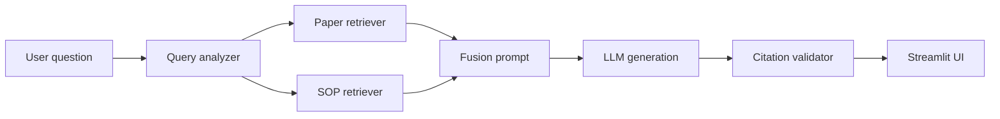

# Lab Fusion RAG Agent

一个面向实验室知识工作的双路 RAG 原型：论文路径提供历史实验参数、方法和结果，SOP/手册路径提供规范流程与安全约束，最后生成带引用、可追溯的回答。

## 核心能力

- 双路检索：`paper` 与 `sop` 分开入库、分开检索，再融合生成。
- 意图路由：`SOP_ONLY`、`PAPER_ONLY`、`HYBRID`，并区分 `SCHOLARLY` / `OPERATIONAL` / `HYBRID` answer mode。
- 论文范围控制：支持 UI 锁定单篇论文、metadata filter、标题软匹配重排。
- 补充材料增强：正文命中后自动拉取同 `project_id` 的 supplementary information。
- 安全优先：涉及可执行实验时，SOP 是规范来源；论文参数不能单独替代本地 SOP。
- 引用约束：回答使用本轮检索片段中的 `citation_hint`，并可做生成后引用校验。
- 入库可追踪：增量入库记录文件指纹，并写入 `corpus_manifest.json` 记录 chunk/解析质量摘要。

## 架构



## 本地启动

1. 准备环境变量：

```bash
cp .env.example .env
```

2. 安装依赖。推荐使用本项目本地虚拟环境；Python 版本建议 `3.10` 或 `3.11`。

```bash
pip install -r requirements.txt
pip install pytest
```

3. 入库：

```bash
make ingest
```

全量重建：

```bash
make rebuild
```

4. 启动 UI：

```bash
make app
```

5. 测试与烟测：

```bash
make test
make smoke
```

## 目录说明

- `app.py`：Streamlit 交互入口。
- `ingest.py`：PDF/Word 解析、元数据抽取、分层切分、Chroma 入库。
- `query_analyzer.py`：结构化 query 分析与 LLM 失败降级。
- `rag_core.py`：双路检索、标题软匹配、SI 增强、prompt bundle 准备。
- `fusion_prompts.py`：融合生成 system prompt 片段。
- `citation_validator.py`：生成后引用校验。
- `eval/`：RAG golden questions 与本地评估脚本。
- `tests/`：不依赖外部 API 的单元测试。

## 推荐 Demo 问题

- “这篇论文里 microgel 的制备步骤和关键参数是什么？”
- “如果我要复现实验，哪些步骤需要遵守本实验室 SOP？”
- “对比两篇 photothermal microgel 论文的刺激方式和参数差异。”
- “Leica DMi8 的基础使用/安全注意事项是什么？”
- “当前上下文里没有提供哪些 protocol 细节？”

## 注意

本项目面向实验室知识辅助，不替代实验室 PI、安全员或机构 SOP。涉及真实实验操作时，必须以本地批准 SOP 和风险评估为准。
