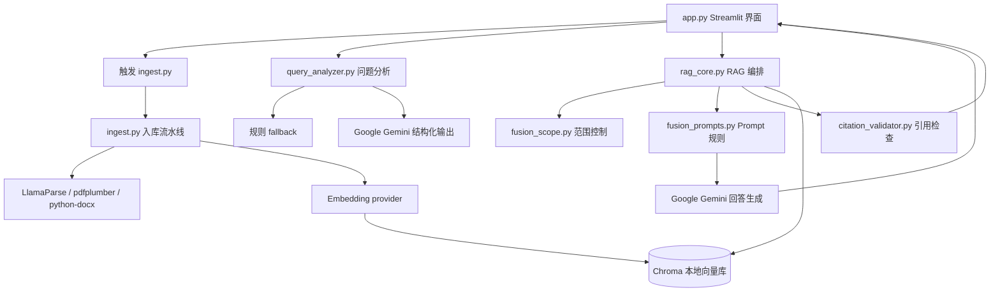
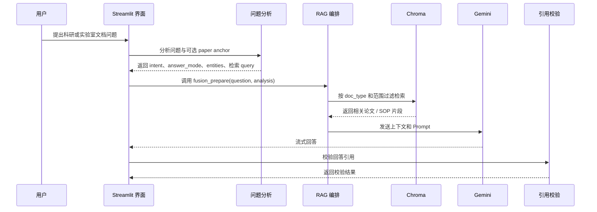

# 架构说明

RMN Agent 是一个本地 Streamlit + Python RAG 应用，用于科研文档和实验室 SOP / 手册的知识问答。它的核心架构选择是把“论文证据”和“可执行操作规范”分开处理：论文用于解释研究方法、实验参数和结果，SOP / 手册用于约束实际操作、安全要求和设备使用。

当前系统是单轮 RAG 编排，不是长期自主规划型 Agent。它更关注一次用户提问中的问题分析、检索路由、证据组织、回答生成和引用检查。

## 模块关系

## 数据流

1. 用户将本地非敏感文档放入 `data/papers/` 或 `data/manuals/`。
2. `ingest.py` 只扫描这两个目录，并把支持的 `.pdf` 和 `.docx` 文件标记为论文或 SOP / 手册。
3. 对论文文件，入库流程会写入 `doc_type=paper`，并通过文件名规则识别正文与补充材料；可用时也会做 LLM 辅助元数据抽取。
4. 对 SOP / 手册文件，入库流程写入 `doc_type=sop` 和 `doc_role=manual`，不走论文题录抽取逻辑。
5. 文档被解析为近似 Markdown 的文本，再经过 header splitting 和 recursive chunking。论文 chunk 默认更小，便于参数级检索；SOP chunk 默认更大，尽量保留完整步骤。
6. embedding 写入本地 Chroma collection。`processed_files.json` 记录已处理文件，`corpus_manifest.json` 记录语料级信息。
7. 查询阶段，`app.py` 将用户问题和可选 paper anchor 传给 `query_analyzer.py`。
8. analyzer 返回 `intent`、`answer_mode`、实体、可选论文范围字段，以及 paper / SOP 两条检索 query。
9. `rag_core.py` 根据 route 和 metadata filter 检索 paper chunk、SOP chunk，或二者同时检索。
10. 检索到的 chunk 被格式化为带 `citation_hint` 的上下文块。
11. `fusion_prompts.py` 根据回答模式组装系统 Prompt，要求模型基于检索证据回答。
12. 模型将回答流式返回 Streamlit 界面。
13. `citation_validator.py` 检查回答中的引用线索是否来自本轮检索 bundle，并标记缺少引用的数字型声明。

## Agent 工作流

## 关键设计选择

- 文档路径分离：`data/papers/` 和 `data/manuals/` 在入库阶段就对应不同 `doc_type`，避免后续只能靠文本内容猜来源。
- 检索前先做问题分析：`query_analyzer.py` 将问题路由到 `PAPER_ONLY`、`SOP_ONLY` 或 `HYBRID`，不是每次都检索所有文档。
- 回答模式与检索路由分开：`intent` 控制检索来源，`answer_mode` 控制回答形态；论文总结和操作规范问题不使用同一种输出规则。
- 论文范围控制：UI 可以锁定单篇论文，analyzer 也可以从问题中提取 source、project_id 或标题提示。
- 标题软重排：`fusion_scope.py` 不把 `paper_scope_paper_title` 直接作为 Chroma 精确过滤条件，而是在 Python 侧做模糊重排，减少空召回。
- 混合检索选项：`rag_core.py` 支持向量检索，也支持向量 + 本地词法评分的混合召回。
- 引用可见性：上下文块暴露 `citation_hint`，回答和 UI 都围绕这些线索展示来源。
- 保守兜底：当 LLM query analyzer 不可用时，规则 fallback 仍能提供基础路由和范围判断。

## 配置面

应用通过 `python-dotenv` 读取环境变量，主要配置包括：

- 模型 key 与模型名：`GOOGLE_API_KEY`、`GEMINI_API_KEY`、`GOOGLE_LLM_MODEL`、`GOOGLE_QUERY_ANALYZER_MODEL`。
- Embedding provider：`EMBEDDING_PROVIDER`、`GOOGLE_EMBEDDING_MODEL`、`OPENAI_EMBEDDING_MODEL`、`ZHIPU_EMBEDDING_MODEL`、`HF_EMBEDDING_MODEL`。
- 解析配置：`LLAMA_CLOUD_API_KEY`、`INGEST_PDFPLUMBER_FALLBACK`。
- Chroma 配置：`CHROMA_PERSIST_DIR`、`CHROMA_COLLECTION_NAME`。
- 检索调参：`RAG_RETRIEVAL_MODE`、`HYBRID_LEXICAL_WEIGHT`、`HYBRID_LEXICAL_POOL_LIMIT`、`STRICT_PROTOCOL_APPENDIX`、`PAPER_PROTOCOL_K_MIN`、`PAPER_PROTOCOL_K_MAX`。
- 入库调参：`SOP_CHUNK_SIZE`、`SOP_CHUNK_OVERLAP`、`INGEST_METADATA_EXCERPT_CHARS`、`DOCX_SEGMENT_CHARS`。

## 当前限制

- 当前 UI 是本地 Streamlit 应用，不是完整 Web 产品。
- 当前没有认证、授权、审计、监控或文档级权限模型。
- 当前没有 REST API 或独立后端服务层。
- 当前仓库没有 Dockerfile 或部署配置。
- 当前仓库只包含 `data/` 占位目录，不包含真实 Demo 语料。
- 引用校验是轻量规则检查，不能证明完整语义忠实。
- 评估目前以单元测试和 JSONL 检索烟测为主，还不是完整评估体系。

## 可扩展点

- UI 层：增加文件上传、演示预设、结果导出和更清晰的用户引导。
- API 层：将 `fusion_prepare` 与生成流程封装为服务接口，便于接入其他前端或演示系统。
- 数据连接器：支持 SharePoint、Google Drive、Notion、ELN 或内部知识库等来源。
- 治理能力：增加基于角色的文档访问、审计日志、脱敏和 SOP 审批状态。
- 可观测性：记录 query route、retrieved sources、延迟、错误和 citation validation 结果。
- 评估能力：扩展 `eval/golden_questions.jsonl`，报告 route accuracy、source coverage、citation quality 和失败案例。
- 部署能力：增加 Docker 打包和环境化配置，让本地 Demo 更容易复现。
