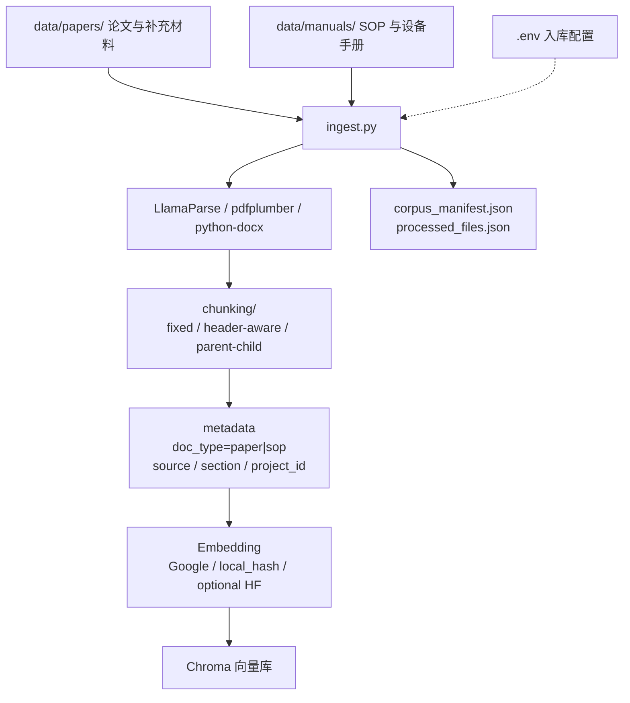
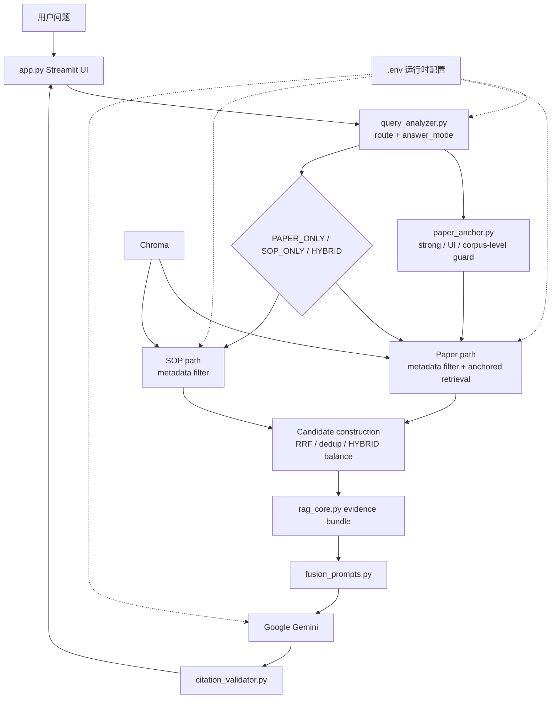
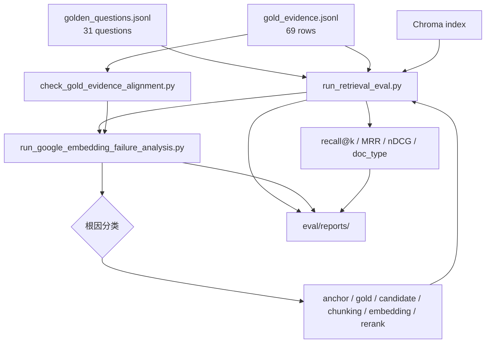

# 架构说明

RMN Agent 是一个本地 Streamlit + Python RAG 应用，用于科研文档和实验室 SOP / 手册的知识问答。它的核心架构选择是把“论文证据”和“可执行操作规范”分开处理：论文用于解释研究方法、实验参数和结果，SOP / 手册用于约束实际操作、安全要求和设备使用。

当前系统是**单轮 RAG 编排 + 离线评估闭环**，不是长期自主规划型 Agent。生产 Demo 路径关注一次提问中的问题分析、检索路由、候选构建、证据组织、回答生成和引用检查；评估路径则通过 golden questions / gold evidence 与 failure analysis 迭代改进 retrieval，**不进入默认在线主链路**。

**Rule reranker 默认关闭**（`RERANKER_PROVIDER=none`），仅作为 benchmark / ablation 可配置项。

---

## 1. 离线入库流程

**要点**

- 论文与手册在**入库阶段**即分离：`data/papers/` → `doc_type=paper`，`data/manuals/` → `doc_type=sop`。
- 论文 chunk 可带 `[DOC]` 前缀与 `project_id`；SOP chunk 保留更大窗口以覆盖完整步骤。
- Chroma 只负责持久化向量与 metadata 过滤检索，不包含业务路由逻辑。

---

## 2. 在线问答流程

**要点**

- `query_analyzer.py` 返回 `intent`、`answer_mode`、实体、双路 `search_queries` 与可选 `paper_scope_*`；LLM 不可用时规则 fallback。
- `paper_anchor.py` 与 analyzer 集成：**corpus-level 问题不自动锚定单篇论文**；UI 选定论文时 deictic 指代跟随 UI anchor。
- `rag_core.py`：向量或 hybrid lexical 召回 → anchored retrieval（RRF 合并）→ HYBRID 下 paper/SOP 候选池（topN ≥ 20）→ evidence bundle。
- `fusion_scope.py` 提供范围过滤与标题软重排；**reranker 非默认必经步骤**。
- `citation_validator.py` 为轻量字符串级检查，非完整事实验证。

### 数据流（在线路径）

1. 用户提问；可选 Streamlit 侧边栏锁定单篇论文。
2. `analyze_query` + `enrich_analysis_with_paper_anchor` 确定 route 与 anchor。
3. `fusion_prepare` 分路检索 Chroma，合并候选，组装带 `citation_hint` 的上下文。
4. `compose_fusion_system_prompt` 按 `answer_mode` 生成系统 prompt。
5. Gemini 流式回答；citation validator 与 debug 面板回显检索诊断（`retrieval_diagnostics`）。

---

## 3. RAG Evaluation 与 Debug Loop

**要点**

- 评估是**旁路闭环**，不阻塞 Streamlit 问答。
- `make eval-gold-check` → `make eval-retrieval` → `make eval-expanded` → failure analysis 报告。
- Failure 标签：`ranking_issue`、`recall_issue`、`gold_label_mismatch`、query anchoring 等。
- **Reranker benchmark**（`none` / `rule` / optional BGE）与 **embedding benchmark** 分离；默认 Makefile 不触发 HuggingFace 下载。
- 当前扩展集 retrieval recall@5 ≈ 0.936（本地语料，非生产指标）；最弱：**paper-only hard negatives**。

---

## 关键设计选择

- **文档路径分离**：入库即写入 `doc_type`，检索按 metadata 过滤，减少 paper/SOP 混淆。
- **Query analysis 先于检索**：`intent` 控制来源，`answer_mode` 控制回答形态。
- **Paper anchor 与 corpus guard**：强信号 / UI anchor 启用 anchored retrieval；泛化问句不强制单篇 scope。
- **HYBRID 候选构建**：paper 与 SOP 分别召回后再 RRF / quota 合并，而非简单交错拼接。
- **Anchored retrieval**：对 `paper_scope_source` 追加检索并与主路 RRF 合并，解决「参考论文里的 microgel」类 deictic 过泛问题。
- **Rule reranker 默认关闭**：ablation 显示 recall@10 升、recall@5 不变、MRR 略降；优先 anchor 与候选池而非调权重刷分。
- **Gold evidence 与问题语义一致**：corpus-level 问题扩展多篇 gold，避免假失败。
- **引用可见性**：`citation_hint` 贯穿 context、回答与 validator。

## 配置面

应用通过 `python-dotenv` 从项目根 `.env` 读取配置，主要分组：

| 分组 | 代表变量 |
| --- | --- |
| 模型 | `GOOGLE_API_KEY`, `GOOGLE_LLM_MODEL`, `GOOGLE_EMBEDDING_MODEL` |
| 入库 | `LLAMA_CLOUD_API_KEY`, `INGEST_PDFPLUMBER_FALLBACK`, `EMBEDDING_PROVIDER` |
| Chroma | `CHROMA_PERSIST_DIR`, `CHROMA_COLLECTION_NAME` |
| 检索 | `RAG_RETRIEVAL_MODE`, `HYBRID_PAPER_CANDIDATE_TOPN`, `ANCHORED_PAPER_RETRIEVAL` |
| Anchor | `ANCHORED_SOURCE_SOFT_MATCH`, `ANCHORED_PAPER_MIN_CHUNKS` |
| Rerank（实验） | `RERANKER_PROVIDER=none`, `RERANK_RULE_WEIGHT` |

## 当前限制

- 本地 Streamlit Demo，无认证、审计、REST API。
- 仓库 `data/` 为占位；完整演示需自备语料并完成 `make ingest`。
- Citation validation 为轻量规则，非 sentence-level 证据对齐。
- Chroma 索引覆盖可能少于 `corpus_manifest` 全量文件，eval 结果依赖本地入库状态。
- Retrieval eval 指标不代表生成质量或生产 SLA。

## 可扩展点

- **RAG 评估**：paper-only query expansion、section-aware retrieval、generation eval、sentence-level alignment。
- **产品化**：Web UI / API、权限、审计、Docker 部署。
- **数据连接器**：SharePoint、ELN、更多文档类型。
- **可选 rerank**：cross-encoder / BGE，仅在 gold 已在 candidate pool 时评估。

更多实验说明见 [`docs/experiments/rag_evaluation.md`](experiments/rag_evaluation.md) 与 [`docs/experiments/google_embedding_failure_analysis.md`](experiments/google_embedding_failure_analysis.md)。
