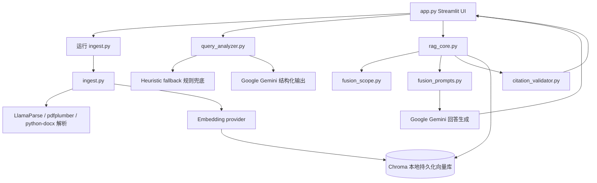
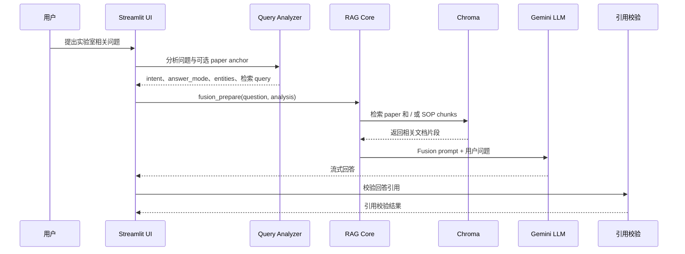

# Architecture

RMN Agent 当前是一个本地 Streamlit + Python RAG 应用。它用于展示一个领域型 AI Agent 如何区分“科研论文证据”和“实验室 SOP / 手册证据”，并在用户提问后完成意图判断、证据检索、融合生成和引用校验。

## 当前模块关系

## 数据流

1. 用户将文档放入 `data/papers/` 或 `data/manuals/`。
2. `ingest.py` 扫描这些目录，并将支持的 `.pdf` 和 `.docx` 文件分类为论文或 SOP / 手册。
3. 对论文文件，入库流程可以进行 LLM 辅助元数据抽取，根据文件名规则识别补充材料，并写入 `doc_type=paper`、`doc_role`、`source`、`project_id` 等字段。
4. 对手册 / SOP 文件，入库流程写入 `doc_type=sop` 和 `doc_role=manual`。
5. 文档被解析为近似 Markdown 的文本，经过 header splitting 和 recursive chunking 后生成 embedding，并写入本地 Chroma collection。
6. `processed_files.json` 记录已处理文件，`corpus_manifest.json` 记录语料级元数据。
7. 查询阶段，`app.py` 将用户问题和可选 paper anchor 传给 `query_analyzer.py`。
8. analyzer 返回结构化字段，包括 `intent`、`answer_mode`、可选 paper scope 字段，以及 paper / SOP 检索 query。
9. `rag_core.py` 根据 route 和 metadata filter 检索 paper chunk 和 / 或 SOP chunk。
10. 检索到的 chunk 会被格式化为带 `citation_hint` 的上下文块。
11. `fusion_prompts.py` 组装 system prompt，指示模型以 scholarly、operational 或 hybrid 方式回答。
12. 模型将回答流式返回 Streamlit UI。
13. `citation_validator.py` 检查回答中的引用是否来自当前检索 bundle，并标记缺少引用的数字型声明。

## Agent 工作流

当前 Agent 工作流是“单轮 RAG 编排”，不是长期自主规划型 Agent。

## 关键设计选择

- **文档路径分离**：论文和 SOP / 手册在入库与检索阶段分开处理，便于讲清楚“研究证据”和“操作规范”的边界。
- **检索前先做意图路由**：系统先判断 `SOP_ONLY`、`PAPER_ONLY` 或 `HYBRID`，避免所有问题都无差别检索所有来源。
- **回答模式与检索路由分离**：`intent` 控制检索路径，`answer_mode` 控制回答形态，让论文总结和实验操作问题有不同输出风格。
- **论文范围锁定**：UI 可锁定某一篇论文；analyzer 也可以通过 source 或 project metadata 影响检索范围。
- **混合检索选项**：默认可使用向量相似度与本地词法评分组合，受 `RAG_RETRIEVAL_MODE` 控制。
- **引用可见性**：上下文块暴露 `citation_hint`，UI 在每轮回答后展示 paper / manual references。
- **保守兜底**：当 LLM query analyzer 不可用时，规则 fallback 仍能提供基础路由能力。

## 配置面

应用通过 `python-dotenv` 读取环境变量，主要配置包括：

- 模型 key 与模型名：`GOOGLE_API_KEY`、`GEMINI_API_KEY`、`GOOGLE_LLM_MODEL`、`GOOGLE_QUERY_ANALYZER_MODEL`。
- Embedding provider 选择：`EMBEDDING_PROVIDER`、`GOOGLE_EMBEDDING_MODEL`、`OPENAI_EMBEDDING_MODEL`、`ZHIPU_EMBEDDING_MODEL`、`HF_EMBEDDING_MODEL`。
- 解析配置：`LLAMA_CLOUD_API_KEY`、`INGEST_PDFPLUMBER_FALLBACK`。
- Chroma 配置：`CHROMA_PERSIST_DIR`、`CHROMA_COLLECTION_NAME`。
- 检索调参：`RAG_RETRIEVAL_MODE`、`HYBRID_LEXICAL_WEIGHT`、`HYBRID_LEXICAL_POOL_LIMIT`、`STRICT_PROTOCOL_APPENDIX`、`PAPER_PROTOCOL_K_MIN`、`PAPER_PROTOCOL_K_MAX`。
- 入库调参：`SOP_CHUNK_SIZE`、`SOP_CHUNK_OVERLAP`、`INGEST_METADATA_EXCERPT_CHARS`、`DOCX_SEGMENT_CHARS`。

## 当前限制

- 当前 UI 是本地 Streamlit 应用，不是生产级 Web 应用。
- 当前没有认证、授权或文档级权限模型。
- 当前没有 REST API 或后端服务层。
- 当前仓库没有 Dockerfile 或部署配置。
- 当前只包含 `data/` 占位目录，不包含真实 Demo 语料。
- 引用校验是轻量规则检查，不能证明完整语义忠实。
- 评估目前以单元测试和 JSONL 检索 smoke script 为主，还不是完整评估 Dashboard。

## 可扩展点

- **UI 层**：增加文件上传、Demo preset、演示引导和结果导出。
- **API 层**：将 `fusion_prepare` 与生成流程封装为 FastAPI 服务，方便集成 Demo。
- **数据连接器**：支持 SharePoint、Google Drive、Notion、ELN、CRM notes 或内部知识库。
- **治理能力**：增加基于角色的文档访问、审计日志、脱敏和 SOP 审批流程。
- **可观测性**：记录 query route、retrieved sources、延迟、错误和 citation validation 结果。
- **评估能力**：扩展 `eval/golden_questions.jsonl`，报告 route accuracy、source coverage、citation quality 和失败案例。
- **部署能力**：增加 Docker 打包和环境化配置，让 Demo 更可复现。
